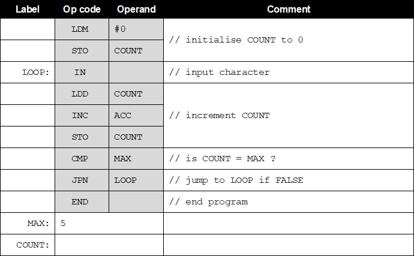
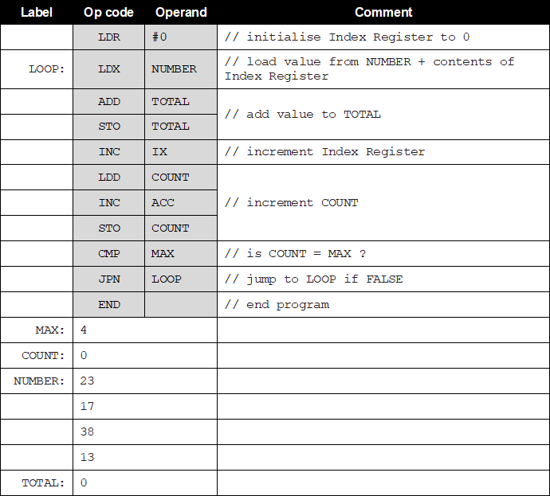
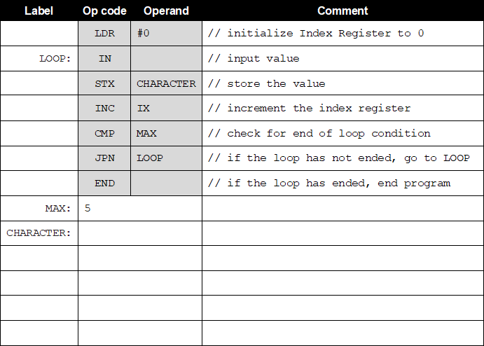

# 9608/42/PRE/O/N/20
Last update: Anuj Verma, 03:16 PM 06/10/2020

These are the files that constute the solution to the pre-release material for Computer Science component 9608/42 of the October/November 2020 examination series.

| Filename | Type | Purpose |
| -- | -- | -- |
| 9608_w20_PM_42 | `.pdf` | The pre-release material file released by CAIE. |
| Planning | `.md` | This is the markdown text file that this PDF was created from. |
| Planning | `.pdf` | You are currently reading this file. It describes the solution used in answering the pre-release material and houses all material apart from code (such as identifier tables and structured English). |
| Main Python notebook | `.ipynb` | The [Jupyter Notebook](https://jupyter.org/) in which the Python code was originally written. |
| Main Python notebook | `.pdf` | The PDF version of the Jupyter Notebook (for the viewer whose system doesn't have Jupyter). |
| Component Programs | `.py` | The Python 3.8 file that contains all executable code (for the viewer whose system doesn't have Jupyter). | 
| Conponent Pseudocode | `.psu` | All pseudocode, grouped by the task numbers, written using an open-source [custom-built extension](https://github.com/eccentricOrange/NPP-CAIE-Pseudocode-Highlighting-plugin). |
| Standalone Compiled Program | `.py` | The final Python program. |
| Standalone Compiled Pseudocode | `.psu` | The final pseudocode. |
| Assembly code | `.docx` | The assembly code done in *Word* to leverage the tables from the question paper. |
| TASK_1_1 | `.png` | The low-level program as required by TASK 1.1. |
| TASK_1_3 | `.png` | The low-level program as required by TASK 1.3. |
| TASK_1_5 | `.png` | The low-level program as required by TASK 1.5. |

<br> <br>

# TASK 1 – Low-level programming
> Low-level programming is a type of programming language that uses op codes and operands to create instructions.
> 
> The table (in the question paper) shows part of the instruction set for a processor that has one general purpose register, the Accumulator (ACC), and an Index Register (IX).

## TASK 1.1
> Write assembly language program code that allows a user to input 5 characters. The characters are not stored.

The program is given in the table below, and is in the attached *Word* document.

<div style="text-align:center"></div>

## TASK 1.2

> Discuss the purpose of the Index Register and how it can be used to access consecutive memory locations.

The Index Register `IX` is used to modify oprands (such as adresses) in low-level programming; we can use it as a counter. If we access the memory location using indexed addressing, we would access the location `n` places after the specified address if the value stored in `IX` is `n`. Consider the example below to access ten consecutive locations:
```
        LDR #0      // Initialize the index register to zero.

LOOP:   LDX 0xFFF6  // If we try to access a memory loaction using indexed
                    // addresssing now, it would be at 0xFFF + IX.

        INC IX      // Increment the contents of the index register.
                    // This has the effect of moving to the next memory location.

        CMP #9      // Compare the value of the counter (IX) with the end condition.
        JPN LOOP    // Loop back to LOOP if the end condition is not yet reached.

        END         // End the program if the loop has ended.
```

## TASK 1.3
> Write assembly language program code that adds the values stored in four consecutive memory locations starting at `NUMBER` using the Index Register.
>
> Store the final total value in memory location `TOTAL`.

The program is given in the image of the table below, and is in the attached *Word* document.

<div style="text-align:center"></div>

## TASK 1.4
> The assembly language instruction set given has the op code `STX`. Discuss the purpose of this op code.

`STX` copies the contents of `ACC` to the address `<address>` + the value from `IX`. The example below would try to store `#48` in memory location `0xFFF6 + #10` (which is `0xFFF`).

```
LDM     #48
LDR     #10
STX     0xFFF6
```

## TASK 1.5
> Amend your solution to **TASK 1.1** to allow the program to store each of the characters input into separate, consecutive memory locations starting at the memory locations labelled `CHARACTER`.

The program is given in the table below, and is in the attached *Word* document.

<div style="text-align:center"></div>

<br><br>

# TASK 2 – Declarative programming
> A knowledge base contains information about students in a class, the colours they like and the colours they do not like. A declarative programming language is used to query the knowledge base.
> 
> Some clauses in the knowledge base are shown.
> ```person(luke).
> person(alice).
> person(taylor).
> person(nadia).
> colour(blue).
> colour(red).
> colour(green).
> colour(yellow).
> likes_colour(alice, yellow).
> likes_colour(alice, blue).
> dislikes_colour(taylor, red).
> dislikes_colour(nadia, green).
> ```
> <br>

<br>

## TASK 2.1
> Two new students are joining the class: Mehrdad and Nigel. They need to be added to the knowledge base.
>
> Four further colours: pink, orange, purple and black need to be added to the knowledge base.
>
> Write clauses to add the two new students and the new colours to the knowledge base.

```
person(mehrdad).
person(nigel).
colour(pink).
colour(orange).
colour(pueple).
colour(black).
```

# TASK 2.2
> Add a clause that states Nadia likes the colour red.

```
likes_colour(nadia, red).
```

# TASK 2.3
> Add a clause that states Mehrdad does not like the colour pink.

```
dislikes_colour(mehrdad, pink).
```

# TASK 2.4
> Write a goal to find all the colours that a person likes.

We will consider Alice as an example and list all the colours she likes.

```
likes_colour(alice, Colour)
```

